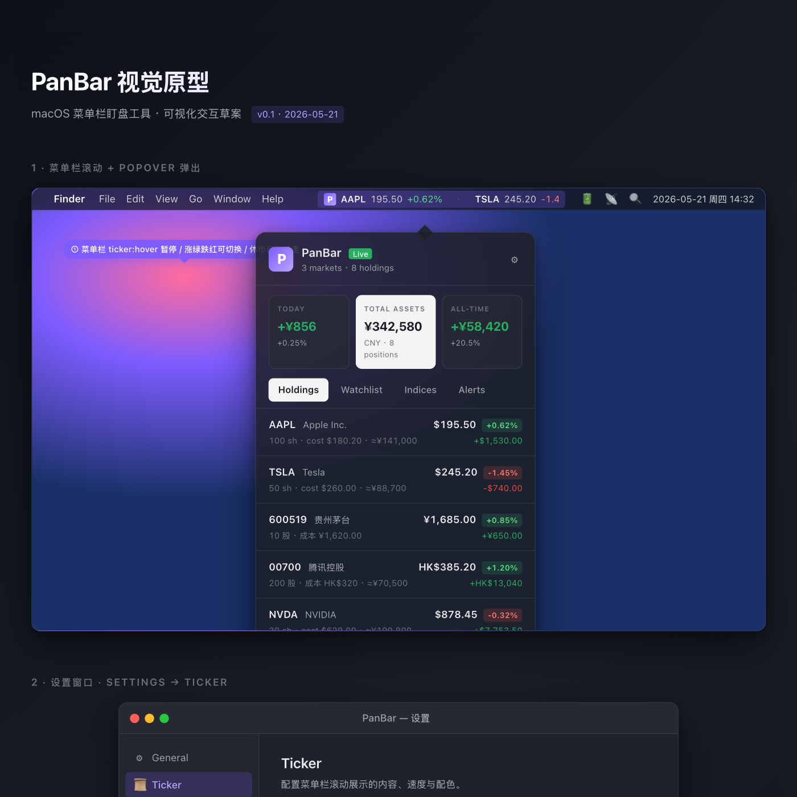

# PanBar

**macOS 菜单栏上的轻量盯盘工具** — 实时滚动自选股价格,一键查看持仓盈亏。
*A lightweight macOS menu bar app for live stock quotes and portfolio P&L.*

[简体中文](README.md) · [English](README.en.md)

[](LICENSE)
[](https://www.apple.com/macos)
[](https://swift.org)
[](https://github.com/TNT-Likely/PanBar/actions/workflows/ci.yml)



---

## 一句话简介

PanBar 把 A / 港 / 美三市行情塞进 macOS 菜单栏的一小条滚动文字里。点开 360pt 的紧凑面板看持仓盈亏、大盘指数、价格预警 — 不抢屏幕、不挂网络、不收集任何数据。

## 功能

- **菜单栏滚动 ticker** — 自定义勾选要滚动的股票 + 三大汇总指标(今日盈亏 / 总资产 / 累计)
- **多市场覆盖** — A / 港 / 美一站式,**自动按本位币(¥ / $ / HK$)汇总**
- **大盘指数** — 8 个预置(沪指 / 深成 / 创业板 / 沪深300 / 恒生 / 道琼斯 / 纳指 / 标普),可选择性显示在 ticker 里
- **价格预警** — 多条件(主+副,AND/OR)、每日触发次数上限、仅交易时段、仅工作日
- **数据源可配** — 腾讯 / 东方财富 / Yahoo / Finnhub,**每市场独立优先级**
- **股票搜索** — 中文 / 拼音 / 代码,直连腾讯 smartbox
- **隐私模式** — 屏幕共享/录屏时自动遮蔽 ticker;⌘⌃M 手动一键切换
- **配色方案** — 东方红涨绿跌 / 西方绿涨红跌 / 黑白单色,实时切换
- **多语言** — 简体中文 / English
- **可自定义快捷键** — 全局录入器,你想用啥按啥
- **全量备份恢复** — 一个 JSON 文件包含全部持仓 / 自选 / 预警 / 设置
- **完全本地** — SQLite + 启动期 FX 缓存 · 无埋点 · 无云同步 · 无广告

## 安装

**下载 DMG**(已 Apple Developer ID 公证,首次打开会弹一次「已验证此 App」提示):

[**↓ 下载最新版**](https://github.com/TNT-Likely/PanBar/releases/latest) → 双击 `.dmg` → 把 PanBar 拖进 Applications。

或从源码构建:

```bash
brew install xcodegen create-dmg
git clone https://github.com/TNT-Likely/PanBar.git
cd PanBar
make run         # 一键构建 + 启动
```

## License

MIT — 详见 [LICENSE](LICENSE)。
